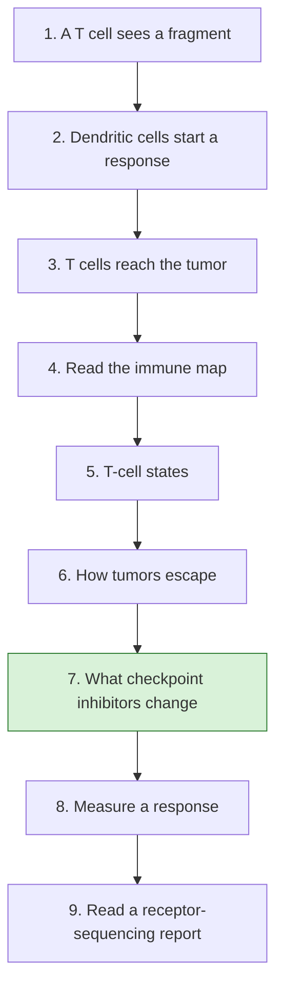

# Why the immune system doesn't just kill a tumor, and what checkpoint inhibitors change

**T cells can recognize cancer, but tumors survive by hiding the target, keeping T cells out or switching them down. Checkpoint inhibitors release one of those brakes; in early triple-negative breast cancer (TNBC), adding one to chemotherapy improved survival.**

This guide follows an immune response from the first clue to its effect on a tumor, then places a checkpoint drug on that route. Plan on about 95 minutes across nine lessons.

## The big ideas

1. **A T cell sees a fragment, not a whole cell.** It recognizes a short protein piece displayed on [human leukocyte antigen (HLA)](/wiki/education/concepts/immunology/antigen-presentation/hla). No display, no recognition.
2. **Starting a response and reaching the tumor are separate jobs.** Dendritic cells must prime T cells in a lymph node, and primed cells must then cross vessels and stroma to touch cancer cells.
3. **Tumors are shaped by the attack.** Immune pressure removes visible cancer cells; survivors hide targets, exclude T cells or exhaust them. This is [immunoediting](/wiki/education/concepts/cancer-biology/what-cancer-is/immunoediting).
4. **Checkpoint inhibitors lift one late brake.** They help T cells that already recognize and reach the tumor; they cannot supply a missing target.
5. **Markers do different jobs.** Stromal tumor-infiltrating lymphocytes (sTILs) predict outcome after chemotherapy; programmed death-ligand 1 (PD-L1) picks who gains from a checkpoint inhibitor only in advanced TNBC.

## The map

```mermaid
flowchart TD
  A["1. A T cell sees a fragment"] --> B["2. Dendritic cells start a response"]
  B --> C["3. T cells reach the tumor"]
  C --> D["4. Read the immune map"]
  D --> E["5. T-cell states"]
  E --> F["6. How tumors escape"]
  F --> G["7. What checkpoint inhibitors change"]
  G --> H["8. Measure a response"]
  H --> I["9. Read a receptor-sequencing report"]
  style G fill:#d9f2d9,stroke:#2e7d32
```

*A learning order. The biology is a cycle, the [cancer-immunity cycle](/wiki/education/concepts/immunology/tumor-immunology/cancer-immunity-cycle), whose steps repeat and overlap.*

## Lessons

| Step | Lesson | Question it answers | Minutes |
|---|---|---|---|
| 1 | [How a T cell sees a cancer cell](/wiki/education/guides/how-the-immune-system-fights-cancer/01-how-a-t-cell-sees-a-cancer-cell) | What does a T cell recognize, and what makes a fragment look foreign? | 12 |
| 2 | [How dendritic cells help start a response](/wiki/education/guides/how-the-immune-system-fights-cancer/02-start-a-response) | How does display become a primed T cell? | 9 |
| 3 | [How T cells reach a tumor](/wiki/education/guides/how-the-immune-system-fights-cancer/03-reach-the-tumor) | What keeps primed T cells out, and why do tumors look hot, excluded or cold? | 11 |
| 4 | [Read an immune map](/wiki/education/guides/how-the-immune-system-fights-cancer/04-read-an-immune-map) | What do tissue patterns and sTIL scores tell you? | 10 |
| 5 | [Why a T-cell count does not tell the whole story](/wiki/education/guides/how-the-immune-system-fights-cancer/05-t-cell-states) | What separates presence, specificity, state and function? | 9 |
| 6 | [Find the step a response can lose](/wiki/education/guides/how-the-immune-system-fights-cancer/06-find-the-failed-step) | What are the main escape routes, and which one failed? | 10 |
| 7 | [What checkpoint inhibitors change](/wiki/education/guides/how-the-immune-system-fights-cancer/07-what-checkpoint-inhibitors-change) | What does PD-1 blockade fix, what did it achieve in TNBC, and what does it cost? | 12 |
| 8 | [Measure each part of a response](/wiki/education/guides/how-the-immune-system-fights-cancer/08-measure-a-response) | Which assay supports which claim? | 12 |
| 9 | [Read a T-cell receptor sequencing report](/wiki/education/guides/how-the-immune-system-fights-cancer/09-read-a-tcr-sequencing-report) | What does a receptor report show, and what does it leave open? | 10 |

After the guide: [compare immune-cell recognition systems](/wiki/education/guides/engineered-cell-therapy/09-car-tcr-til-comparison) (8 minutes) shows how engineered cells change the recognition rules.

## Concepts you will use

- **Recognition and response:** [T-cell receptor](/wiki/education/concepts/immunology/t-cells/t-cell-receptor), [neoantigen](/wiki/education/concepts/immunology/antigen-presentation/neoantigen), [three-signal priming](/wiki/education/concepts/immunology/t-cells/t-cell-priming-three-signals), [CD4 T-cell subsets](/wiki/education/concepts/immunology/t-cells/cd4-t-cell-subsets), [T-cell exhaustion](/wiki/education/concepts/immunology/t-cells/t-cell-exhaustion).
- **The tumor's side:** [T-cell exclusion mechanisms](/wiki/education/concepts/immunology/tumor-immunology/t-cell-exclusion-mechanisms), [immune escape](/wiki/education/concepts/immunology/tumor-immunology/immune-escape), [adaptive immune resistance](/wiki/education/concepts/immunology/tumor-immunology/adaptive-immune-resistance), [natural killer (NK) cell receptors](/wiki/education/concepts/immunology/innate-and-unconventional-cells/nk-cell-receptors).
- **Drugs and markers:** [the KEYNOTE-522 regimen](/wiki/education/concepts/breast-cancer/treatment-setting/the-keynote-522-regimen), [PD-L1 scoring](/wiki/education/concepts/measurement/pathology-readouts/pd-l1-scoring), [sTIL scoring](/wiki/education/concepts/measurement/pathology-readouts/stil-scoring), [prognostic versus predictive](/wiki/education/concepts/evidence-and-statistics/biomarkers/prognostic-vs-predictive), [immune-related adverse events](/wiki/education/concepts/therapeutics/toxicities-and-supportive-care/immune-related-adverse-event).
- **How a target cell ends:** killing, damage and arrest need different evidence. Compare [apoptosis and its B-cell lymphoma 2 (BCL-2) family control](/wiki/education/concepts/cancer-biology/cell-death-and-survival/apoptosis-and-bcl2-family), [necrosis](/wiki/education/concepts/cancer-biology/cell-death-and-survival/necrosis) and [senescence](/wiki/education/concepts/cancer-biology/cell-death-and-survival/senescence), or use the [apoptosis, necrosis and ferroptosis comparison](/wiki/education/concepts/cancer-biology/cell-death-and-survival/apoptosis-vs-necrosis-vs-ferroptosis).

The [immunology section of the concept index](/wiki/education/concepts/index#immunology) lists every immune concept.

## Check your understanding

A tumor sample is full of T cells and stains PD-L1-positive. Why is that encouraging, and what is still open?

**One answer:** T cells reached the tumor, and PD-L1 there is often induced by T cells attacking it. Still open: whether those cells recognize the cancer, whether the tumor has lost HLA or [beta-2 microglobulin (B2M)](/wiki/education/concepts/immunology/antigen-presentation/b2m) display, and whether a checkpoint drug adds benefit in this setting.

## Applied to Diana

Use [the immune-context question](/wiki/questions/is-tumor-hot), [the presentation-loss question](/wiki/questions/hla-b2m-loss) and [the checkpoint rechallenge decision](/wiki/questions/pembrolizumab-rechallenge) for current interpretation. Those pages own case findings and decisions; this guide supplies the shared biology.

## What is still uncertain

- Whether checkpoint benefit in early TNBC comes from treatment before surgery, after it, or both; KEYNOTE-522 was not designed to separate them. The [perioperative immune window](/wiki/education/concepts/immunology/tumor-immunology/perioperative-immune-window) explains why the timing is a biological question.
- No validated marker yet identifies which early-TNBC patients gain from pembrolizumab.
- How much of a response comes from reviving T cells already in the tumor versus recruiting new ones.
- Whether opening an exclusion barrier helps people; so far that has been shown mainly in mice.

Continue with [personalized vaccine design](/wiki/education/guides/personalized-cancer-vaccine/index), [engineered cell therapy](/wiki/education/guides/engineered-cell-therapy/index) or [reading cancer evidence](/wiki/education/guides/reading-cancer-evidence/index).

## Sources and scope

Source-checked November 8, 2026. A foundation path; lessons and concepts carry their detailed sources. Expert and learner review pending.

- [National Cancer Institute (NCI): checkpoint inhibitors](https://www.cancer.gov/about-cancer/treatment/types/immunotherapy/checkpoint-inhibitors).
- [Chen and Mellman, 2013: the cancer-immunity cycle](https://pubmed.ncbi.nlm.nih.gov/23890059/).
- [Schmid et al., 2024: KEYNOTE-522 overall survival](https://pubmed.ncbi.nlm.nih.gov/39282906/).
- [FDA: pembrolizumab label, supplement 194 (2026)](https://www.accessdata.fda.gov/drugsatfda_docs/label/2026/125514s194lbl.pdf), section 14.20.
